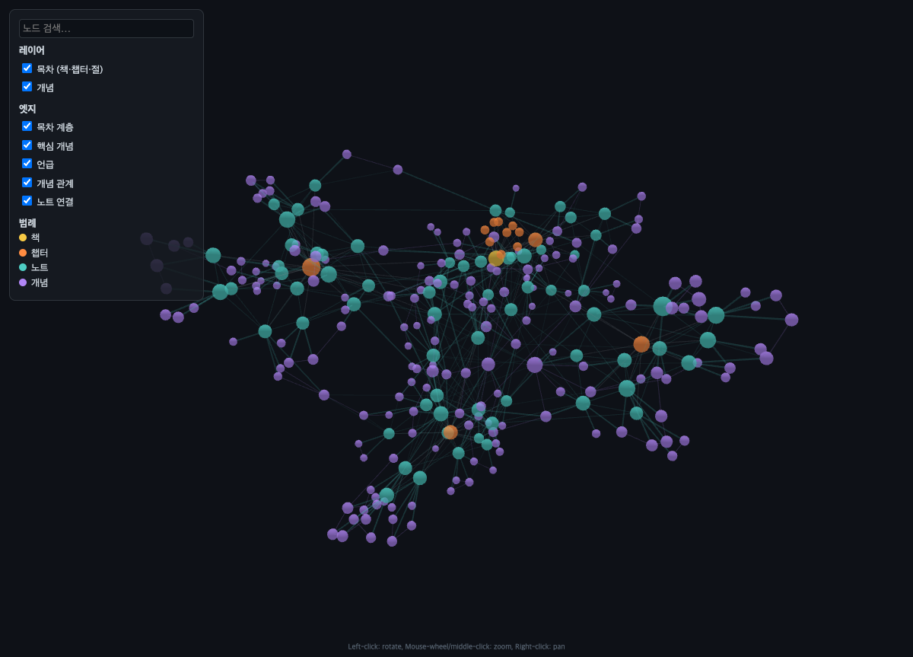

# book-atlas — 원서 한 권을 목차 구조 그대로

원서 PDF 한 권을 목차 구조 그대로 충실하게 정리하고, 책→챕터→절→개념의 연결을 three.js 기반 3D 그래프로 시각화하는 정리 중심 학습 스킬입니다. 목차를 추출·검산하여 저장소를 부트스트랩하고, 절 단위 노트(작성 규칙 12개)와 책 전체 용어집을 관리하며, 세션마다 그래프를 자동 재생성합니다.

각 절 노트는 `## 스스로 확인` 질문으로 끝납니다. 혼자 답해 본 뒤 **모범답안을 요청**하면
노트와 원문에서만 끌어와 `(책 p.NNN)` 근거를 달아 써 줍니다. 반복 퀴즈 루프나 약점
추적은 일부러 하지 않습니다 — 이 스킬에는 gap 파일도 세션 로그도 없습니다.

## 설치 및 제거

```bash
git clone https://github.com/sing-u8/book-atlas.git
cd book-atlas
```

```bash
# Claude Code에 설치(기본값 — 인자를 생략해도 같다)
./install.sh --claude

# Codex에 설치
./install.sh --codex

# 두 호스트에 모두 설치
./install.sh --all
```

Codex 설치본은 `${CODEX_HOME:-$HOME/.codex}/skills/book-atlas/`, Claude Code 설치본은
`~/.claude/skills/book-atlas/`에 놓입니다. Codex에서는 설치 다음 턴부터 자동으로
발견되며, 명시적으로 호출하려면 `$book-atlas`를 사용합니다. 제거할 때도 같은 대상을
`./uninstall.sh --codex|--claude|--all`로 지정합니다.

## 사용 흐름

### 1. 온보딩 (저장소 부트스트랩)
- PDF 스캔본 검사
- 목차 자동 추출 및 계층 판정
- 쪽 오프셋 검산 (표본 3개)
- `_global/config.md` (언어·vault명) 및 `source-manifest.md` (목차·오프셋) 작성
- 챕터 디렉터리·용어집·그래프 뼈대 생성

### 2. 정리 세션 (기본 루프)
1. 진행 위치 확인
2. 새 챕터: `_coverage.md` 작성 → 분할·병합 규칙 적용
3. 절 노트 작성 (작성 규칙 12개 준수)
4. 용어집 등재 → `check-note.sh` 게이트
5. 챕터 완결: `_chapter.md` 완성 → `check-chapter.sh` 게이트
6. 그래프 재생성 (`build-graph.py`) → 경고 처리 → `graph/graph.html` 새로고침

### 3. 그래프 보기


*1부(1~4장)를 정리한 시점의 그래프. 주황이 챕터, 청록이 절 노트, 보라가 개념이다.*

타입별 노드 색상(책·챕터·노트·개념), 레이어/엣지 토글, 노드 검색, 호버 하이라이트,
Obsidian 클릭 지원. 좌클릭 회전 · 휠 확대 · 우클릭 이동.

## 저장소 구조 (`{book-slug}-atlas/`)

```
├── _global/
│   ├── config.md              # 언어, vault명, 진행 위치
│   └── source-manifest.md     # 목차 트리, 쪽 오프셋 (정본)
├── _glossary.md               # 책 전체 단일 용어집
├── _assets/                   # 추출 도표
├── graph/
│   ├── graph.html             # 뷰어 (불변)
│   ├── graph-data.js          # 빌드 산출물 (손 편집 금지)
│   └── lib/3d-force-graph.min.js
├── chapter-01-{slug}/
│   ├── _chapter.md            # 챕터 개요
│   ├── _coverage.md           # 원문 커버리지 대응표
│   └── 01-{slug}.md           # 절 노트 (H2 6개·도표·연결)
└── chapter-NN-{slug}/
```

절 노트 필수 섹션: 한눈에 보기 · 왜 이 절인가 · 본문 정리 · 개념 · 연결 · 스스로 확인.

## 하는 일과 하지 않는 일

| 한다 | 하지 않는다 |
|---|---|
| 목차 구조 그대로 절 노트 작성(규칙 12개) | 반복 퀴즈 루프 |
| 책 전체 용어집 관리 | 꼬리질문 사슬 |
| 책→챕터→절→개념 3D 그래프 | 약점·막힘 추적(gap 파일 없음) |
| `## 스스로 확인` 질문 심기 | 세션 로그 |
| **그 질문의 모범답안 작성** | 점수 매기기 |
| 산출물 검수·보강, 원문 대조 | |

### 모범답안은 어떻게 나오나

혼자 답해 본 뒤 "이 질문 모범답안 써 줘"라고 하면 —

- **노트와 원문에서만** 끌어옵니다. 노트로 부족하면 그 절의 원문을 다시 뽑아 확인하고,
  거기에도 없으면 **책이 답하지 않는 질문이라고 밝힙니다.** 지어내지 않습니다.
- 근거를 `(책 p.NNN)` 로 답니다.
- 자기 답을 함께 보여주면 **무엇이 빠졌는지만** 짚습니다.
- **답안은 대화로만 냅니다.** 노트 위쪽은 6개 H2 스키마라 자리가 없고, 구분자 아래
  `## 내 메모` 는 사용자 영역이라 스킬이 쓰지 않습니다. 남기고 싶으면 직접 옮기세요.

## 참고 문서

- [설계 스펙](docs/specs/2026-08-31-book-atlas-design.md) — 전체 구조·스키마·게이트·이식 지도
- [구현 계획](docs/plans/) — 작업 분해·일정·마일스톤

설계 문서와 `references/` 에 나오는 **`deep-tutor`** 는 이 스킬의 전신입니다. 그 스킬의
"책 모드"를 이식해 정리 중심으로 다시 만든 것이 book-atlas 이고, 문서의 "deep-tutor 와
달리 ~" 는 그 과정에서 내린 설계 판단을 남긴 것입니다. 별도 스킬이며 공개돼 있지
않습니다 — **book-atlas 는 그것 없이 혼자 완결됩니다.**
