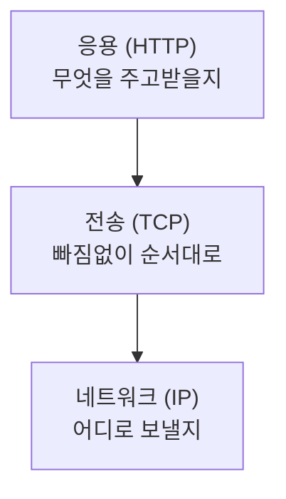
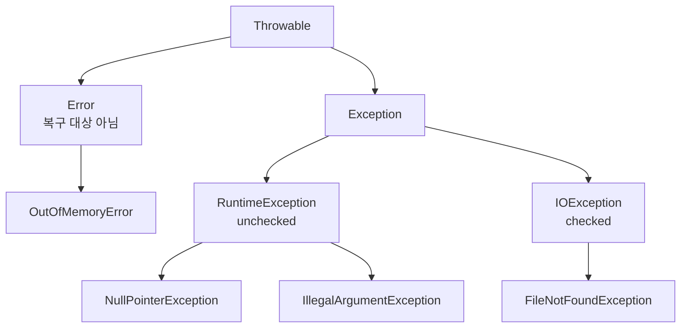
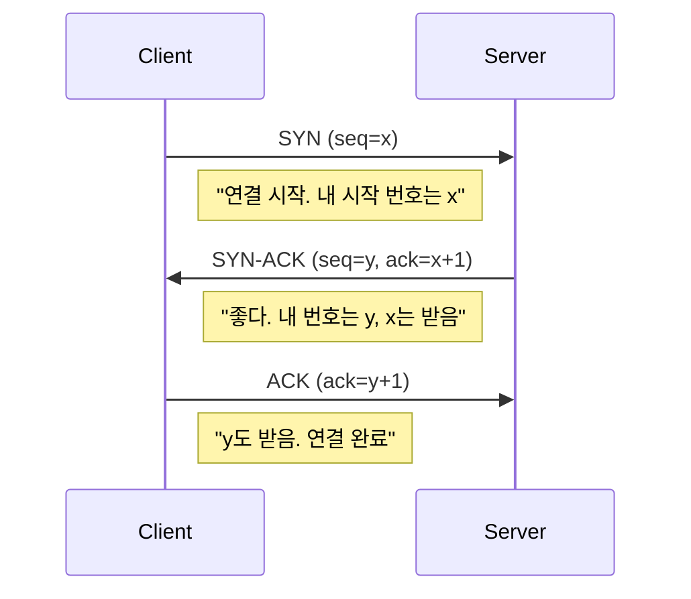
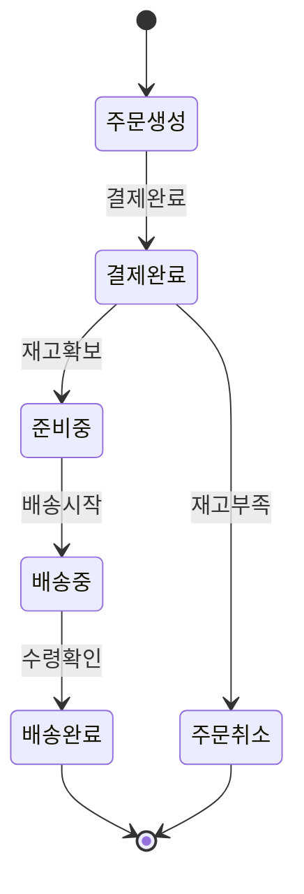
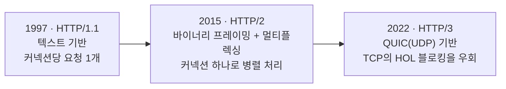
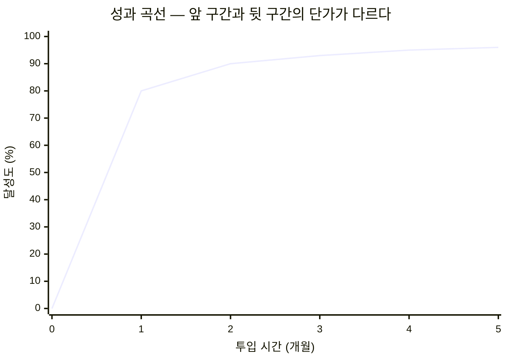

# 도표 재현·추출 규칙

> 책의 도표를 정리물에 어떻게 담을지 — 텍스트로 다시 그릴지, 이미지를 그대로 뽑을지 정하는 기준과, 정했다면 복사해 쓰는 여덟 가지 골격.
> `note-rules.md` 규칙 6("도표 최소 1개")이 도표의 **있다/없다**만 검사한다면, 이 문서는 그 도표를 **무엇으로·어떻게** 채우는지 정한다.

---

## 1. 언제 읽는가

- 노트에 도표를 넣을 자리(보통 `## 본문 정리`에서 그 도표가 설명하는 대목 옆)를 쓰기 **직전** — 재현할지 추출할지부터 정한다
- 정리 중 책의 도표를 마주칠 때마다
- 노트를 보강할 때, 설명이 안 서는 원인이 "도표가 구조를 못 보여줘서"로 판단됐을 때

---

## 2. 판단 기준 — 재현이냐 추출이냐

방식은 **혼합**이다. 도표 종류에 따라 텍스트로 다시 그리거나(재현), PDF에서 이미지를 그대로 뽑는다(추출).

| 처리 | 대상 | 이유 |
|---|---|---|
| **재현** (Mermaid / ASCII / 마크다운 표) | 개념도 · 트리 · 계층도 · 상태 전이 · 단순 시퀀스 · **값이 읽히는 차트** | 텍스트라 grep에 걸리고, git diff에 보이고, 저작권 문제가 없다 |
| **추출** (`pdfimages` → 실패 시 `pdftoppm`) | **값이 안 읽히는** 성능 그래프 · 워터폴 차트 · 실제 화면 스크린샷 · 재현하면 정보가 크게 깎이는 복잡한 도해 | 정보가 이미지 자체(곡선의 형태·픽셀·색)에 있어 텍스트로 옮기면 사라진다 |

표의 왼쪽 두 칸만으로는 모든 도표를 분류할 수 없다 — "재현하면 정보가 크게 깎이는 복잡한 도해"라는 항목 자체가 판단을 요구한다. 그 판단을 감이 아니라 아래 세 질문으로 내린다. **Q1 → Q2 → Q3 순서로 적용하고, 답이 나오는 첫 질문에서 멈춘다** — 다음 질문까지 갈 필요 없이 앞에서 이미 답이 나왔다면 거기서 확정한다.

**Q1. 이 도표가 전달하는 정보가 "구조"인가, "실측값의 시각적 형태"인가?**
구조(무엇이 무엇에 연결·포함·선행되는가)면 재현. 실측값의 시각적 형태(곡선의 기울기, 분포의 형태, 색 배치, 실제 픽셀)면 추출. 그 형태 자체가 저자가 증명하려는 주장의 증거이기 때문이다. 다만 차트는 이 질문만으로 끝나지 않는다 — 판정 기준은 Q3 다음 문단.

**Q2. (Q1이 애매하면) §3의 골격 중 하나로 일단 재현해 본다. 그 재현본만 보고도 원저자의 주장을 독자가 검증할 수 있는가?**
검증할 수 있으면 재현으로 확정한다. 정보가 빠져서 검증이 안 되면 추출로 바꾼다 — 예를 들어 "A가 B보다 빠르다"는 주장의 근거가 그래프 두 곡선의 기울기 차이라면, 그 기울기는 표로 재현할 수 없다.

**Q3. 원본이 애초에 "그리는" 대상이 아니라 "찍는" 대상인가?**
실제 앱 화면 스크린샷처럼 그 자체가 캡처물이면 재현이라는 선택지가 없다. 바로 추출이다.

**차트는 종류만으로 갈리지 않는다.** 막대그래프든 선그래프든, 값을 손실 없이 옮길 수 있으면 차트 종류와 무관하게 재현한다 — 값이 몇 개뿐이면 §3의 비교표로, 축 위의 추세가 요점이면 §3의 `xychart-beta`로 **그래프 그대로** 옮긴다. 추출은 값의 나열이 아니라 도형의 모양 자체(곡선의 굴곡, 분포의 형태, 색 배치)가 주장의 증거일 때로 한정한다. 예를 들어 막대 4개짜리 성능 비교 차트는 각 막대 값을 표 한 줄씩으로 옮겨도 정보가 그대로 보존된다 — 비교표로 재현한다. 값이 20개쯤 되고 오르내림이 요점이면 표로는 추세가 안 보이므로 `xychart-beta`로 재현한다. 반대로 지연 시간이 시간에 따라 요동치는 꺾은선 그래프는 "요동의 모양" 자체가 근거이므로 표로 옮기면 그 모양이 사라진다 — 추출한다.

시퀀스에 대한 예외 하나: 참가자가 많거나 화살표가 교차해서 ASCII로 그리기 번거로워져도, 그 시퀀스가 "구조"(누가 누구에게 무엇을 언제 보내는가)를 보여주는 것이라면 여전히 **재현** 대상이다. 다만 도구를 ASCII 대신 Mermaid로 바꾼다(§4). 복잡도가 올라가는 것과 정보의 성격이 값에서 구조로 바뀌는 것은 다른 문제다 — 전자는 재현 안에서의 도구 선택이고, 후자만 재현/추출을 가른다.

---

## 3. 재현 패턴 라이브러리

여덟 종류 모두 **복사해서 내용만 바꿔 쓰는** 골격이다. "적절히 그린다"로 넘어가지 않는다.

여섯은 **관계·수치**를 그리므로 Mermaid고, 하나는 마크다운 표(비교표), 마지막 하나만 ASCII인데 그 이유는 4절에 있다.

**Mermaid는 그림 안에 주석을 달기 어렵다.** 그래서 ASCII 골격이 `▶`로 달던 "여기서 무엇을 봐야
하는가"는 코드펜스 **바로 아래 한 줄**로 옮긴다. 이 한 줄을 빠뜨리면 도표는 그려지지만 무엇을
보라는 건지가 사라진다 — 형식만 바뀌고 설명이 사라지면 개악이다.

### 계층도 — 레이어가 위아래로 쌓일 때

**언제 쓰는가**: 위 계층이 아래 계층의 존재를 "당연한 것"으로 전제하고 동작할 때.



▶ 화살표는 "이 계층이 아래 계층을 당연한 것으로 쓴다"는 뜻이다 — 데이터가 흐르는 방향이 아니다.

### 트리 — 분기·포함 관계일 때

**언제 쓰는가**: 하나가 여럿으로 갈라지거나(분류), 여럿을 안에 담을 때(상속·디렉터리 구조).



▶ checked/unchecked 경계는 "RuntimeException을 상속했는가" 하나로 갈린다 — 이 분기점이 구조의 핵심이다.

### 시퀀스 — 시간 순 주고받음일 때

**언제 쓰는가**: 시간 순서대로 오가는 요청·응답·메시지를 보여줄 때.



▶ `Note`가 각 메시지의 뜻을 나른다. 메시지 이름만 남기면 무엇을 합의하는 절차인지가 사라진다.

### 상태 전이 — 상태와 전이 조건이 있을 때

**언제 쓰는가**: 유한한 상태들 사이를 조건이 붙은 화살표로 옮겨 다닐 때.



▶ 화살표 위 라벨이 전이 조건이다. `[*]`로 빠지는 상태가 종료 상태 — 거기서 상태 기계가 멈춘다.

### 비교표 — 두세 항목의 축별 대조일 때

**언제 쓰는가**: 둘 이상의 대상을 같은 기준(축)들로 나란히 대조할 때. 도표가 아니라 **마크다운 표**를 그대로 쓴다.

| 축 | TCP | UDP |
|---|---|---|
| 연결 방식 | 연결지향 (3-way handshake) | 비연결 |
| 순서 보장 | 보장 | 보장 안 함 |
| 손실 시 재전송 | 있음 | 없음 |
| 헤더 오버헤드 | 20바이트 이상 | 8바이트 |
| 적합한 상황 | 순서·신뢰성이 지연보다 중요 (파일 전송) | 지연이 신뢰성보다 중요 (실시간 스트리밍) |

축은 반드시 병렬이어야 한다 — 한쪽에만 있고 다른 쪽엔 없는 축은 대조가 아니라 나열이다.

(마크다운 표는 `check-note.sh`가 도표로 세지 않는다 — §4 끝 참고.)

### 타임라인 — 버전·역사 전개일 때

**언제 쓰는가**: 버전이나 사건이 시간 순으로 이어지고, 그 사이 "왜 바뀌었는지"가 중요할 때.



▶ 각 칸의 아랫줄은 "이전 버전의 무엇이 병목이었는가"에 대한 답이다. 연도와 이름만 나열하면 타임라인이 아니라 목록이 된다.

(Mermaid의 `timeline` 다이어그램을 써도 된다. 다만 렌더러 버전을 타므로, 확실하게 그려지는 쪽은 위처럼 `flowchart LR`이다.)

### 수치 추세·분포 — 축이 있는 실제 그래프일 때

**언제 쓰는가**: x축과 y축에 **값**이 있고, 그 값의 오르내림·크기 비교가 요점일 때.
성과 곡선, 시간에 따른 증감, 항목별 크기 비교. 선으로 그릴 것을 글자로 흉내 내지 않는다.



▶ 0→80은 한 달, 80→96은 넉 달이다. 곡선이 눕는 구간이 "마지막 10%"이고, 95% 위쪽은 아직 아무도 가 본 적이 없다.

주석이 필요하면 **차트 아래 한 줄로** 단다 — `xychart-beta`에는 그림 안에 화살표 주석을 다는 문법이 없다.
막대로 바꾸려면 `line [...]` 을 `bar [...]` 로 바꾸면 된다. 둘을 겹쳐 그릴 수도 있다.

두 축 위의 **위치**로 대상을 배치하는 그림(중요도×실현가능성 사분면 같은 것)은 `quadrantChart`를 쓴다.

> **렌더러 주의.** `xychart-beta`는 이름 그대로 beta이고 Mermaid 10.3 이상에서 그려진다. Obsidian이
> 옛 버전을 묶고 있으면 이 블록만 렌더되지 않는다. 노트를 쓴 뒤 **한 번은 실제로 열어 확인하고**,
> 안 그려지면 그 도표만 아래 "정렬·수량"의 ASCII 막대로 되돌린다 — 다른 도표까지 되돌리지 않는다.

### 정렬·수량 — 자리와 크기 자체가 정보일 때

**언제 쓰는가**: 문장 안에서 토큰이 갈리는 위치, 막대의 길이, 값의 자릿수 정렬, 전/후의 자리 비교처럼
**글자를 어디에 놓느냐가 곧 내용인 경우.** 이것만 ASCII다 — Mermaid에는 이걸 표현할 문법이 없다.

```text
원문:  I can't wait to build awesome AI applications

 ┌───┬──────┬────┬───────┬─────┬────────┬──────────┬─────┬───────────────┐
 │ I │  can │ 't │  wait │  to │  build │  awesome │  AI │  applications │
 └───┴──────┴────┴───────┴─────┴────────┴──────────┴─────┴───────────────┘
   1     2     3      4      5      6         7        8          9

  코딩            ██████████████████  30.4%
  이미지·영상     ████████            17.1%
  교육            █                    1.5%
```

▶ 위는 경계의 **위치**가, 아래는 막대의 **길이**가 정보다. 상자와 화살표로 바꾸면 그 정보가 사라진다.

---

## 4. 형식 선택 — Mermaid냐 ASCII냐

**기준은 노드 개수가 아니라 무엇을 그리는가다.**

| 그리는 것 | 형식 |
|---|---|
| **관계** — 흐름·분기·계층·트리·시퀀스·상태 전이·의존·시간 전개 | **Mermaid** (`flowchart` · `sequenceDiagram` · `stateDiagram-v2`) |
| **수치** — 축 위의 값, 추세, 항목별 크기 비교 | **Mermaid** (`xychart-beta` · `quadrantChart`) |
| **자리와 정렬** — 토큰 경계, 값의 자릿수 맞춤, 전/후 위치 대조 | **ASCII** |

노드가 셋뿐이어도 관계를 그리는 것이면 Mermaid다. 애매하면 이렇게 묻는다 —
**"손으로 그린다면 상자와 화살표를 그릴까, 축을 긋고 점을 찍을까, 자를 대고 칸을 맞출까."**
앞의 둘이면 Mermaid, 마지막이면 ASCII. **축에 값이 있으면 그것은 그래프다** — 글자로 곡선을 흉내 내지 않는다.

**왜 관계는 Mermaid인가.** 노트를 읽는 곳은 Obsidian이고, 거기서 Mermaid는 **실제 그림으로 렌더된다.**
ASCII는 고정폭 텍스트 덩어리로 남는다. 예전 이 문서는 "노드 6개 이하면 ASCII"라는 개수 기준을 뒀고
근거로 "렌더러 없이 터미널·grep에서도 읽힌다"를 들었다 — 그 장점 자체는 사실이지만, **터미널은 노트를
읽는 화면이 아니다.** 실측으로 이 기준은 실패했다: AI Engineering 1장 24개 노트에서 도표 52개가 나왔는데
**Mermaid는 0개**였다. 개별 도표는 대개 노드가 6개 이하라, 개수 기준이 관계도까지 전부 ASCII로 몰았다.
읽는 사람이 불편하다고 지적한 것이 바로 이 결과다.

**ASCII가 남는 자리는 좁지만 분명하다.** 정렬이 곧 내용인 도표는 Mermaid로 옮기면 정보가 사라진다.
원서의 도표를 재현할 때 특히 그렇다 — 값이 인쇄된 막대 그래프, 토큰 경계, 표 형태의 원문 재현.

**반드시 지킬 것 — Mermaid는 항상 코드펜스 안에만 둔다.** Mermaid의 서브루틴 노드 문법은 글자 그대로
`id[[Label]]`이고, 이건 Obsidian 위키링크 문법 `[[Label]]`과 정확히 겹친다.

`check-note.sh`는 용어 전수 대조를 하기 전에 코드펜스 안쪽을 전부 걷어낸다 — 정확히 이 충돌을 막기
위해서다(`build-graph.py`도 같은 이유로 같은 일을 한다). 펜스 없이 본문에 그냥 적으면 검사기가
`[[Label]]`을 진짜 위키링크로 읽고 "Label이 용어집에 없다"며 실패시킨다 — 도표에는 아무 문제가 없는데도
검사만 헛되이 걸린다.

### 기계가 도표로 인정하는 것

`check-note.sh`의 도표 존재 검사(노트당 최소 1개)는 딱 두 가지만 도표로 센다.

| 인정 | 형태 |
|---|---|
| 코드펜스 | 여는 줄이 **정확히** 백틱 3개 + `mermaid`, 또는 백틱 3개 + `text` 인 펜스 |
| 임베드 | `![[_assets/` 로 시작하는 이미지 임베드 |

여기서 세 가지가 따라 나온다. **첫째, ASCII 골격은 반드시 백틱 3개 + `text` 로 연다** — 펜스 없이 적거나 다른
태그를 붙이면 도표로 세지 않는다. 여는 줄에 그 태그 말고 다른 것이 붙으면 안 된다 — 뒤에 공백 한 칸만 있어도
인정되지 않는다. **둘째, `java`·`python`·`bash` 같은 코드 리스팅 펜스는 도표가 아니다** — 코드 예제만 잔뜩 있는
노트는 이 검사를 통과하지 못한다. **셋째, 마크다운 표는 도표가 아니다** — §3의 비교표는 훌륭한 재현 수단이지만
기계 검사에는 안 잡히므로, 비교표를 그 노트의 유일한 도표로 삼지 않는다. 검사 대상은 구분자 위(스킬 영역)뿐이다.

---

## 5. 추출 절차 — `extract-figure.sh`

재현이 아니라 추출로 정했다면(§2) 이 스크립트를 쓴다.

```bash
"<book-atlas-root>/scripts/extract-figure.sh" <pdf> <page> <label> <out-dir>
```

`<book-atlas-root>` 해석은 SKILL.md의 정의를 따른다.

인자 4개, 순서 고정:

| 순서 | 인자 | 의미 |
|---|---|---|
| 1 | `<pdf>` | 원본 PDF 경로 |
| 2 | `<page>` | 추출할 페이지 — 숫자만 허용 |
| 3 | `<label>` | 도표 식별자, 예: `fig8-3` — 파일명에 그대로 들어간다 |
| 4 | `<out-dir>` | 저장 디렉터리 — 언제나 vault 루트의 `_assets`, 예: `ai-engineering-atlas/_assets` (없으면 만든다) |

**`<page>`는 PDF 기준 페이지지, 책에 인쇄된 페이지 번호가 아니다.** 표지·서문·목차 때문에 둘은 보통 어긋난다. 이 스크립트도, §6의 `pdftotext -layout -f/-l`도 전부 PDF 기준이다. 책 페이지와 PDF 페이지의 오프셋은 그때그때 계산하지 말고 `_global/source-manifest.md`의 구간별 오프셋 표를 참조한다 — 그 표가 오프셋의 유일한 정본이다(`toc-pipeline.md` §4·§7).

동작 순서: `pdfimages`로 해당 페이지에서 개별 이미지를 뽑아 가장 큰 것을 고른다(8KB 미만은 로고·장식 조각으로 보고 버린다). 그게 실패하면 `pdftoppm`으로 페이지 전체를 통째로 렌더한다 — 이 경로를 타면 필요한 부분만 잘라 써야 한다는 안내가 stderr에 같이 찍힌다. 성공하면 `<out-dir>/{book-slug}-p{page}-{label}.png`로 저장하고, stdout에 저장 경로와 붙여넣을 임베드 한 줄을 순서대로 출력한다.

**exit 0이 아니면 무조건 재현으로 폴백한다. 재시도하지 않는다.** PDF가 없거나, 페이지 번호가 숫자가 아니거나, `pdfimages`/`pdftoppm`이 없거나, 둘 다 8KB 미만 결과만 내면 exit 1이다. 같은 인자로 다시 돌려도 같은 PDF의 같은 페이지에서 같은 결과가 나올 뿐이다 — 재시도는 턴만 소모한다. exit 1을 받으면 그 즉시 §3의 골격으로 돌아가 재현한다.

**임베드 형식은 정확히 이 형태다.**

```
![[_assets/<파일명>.png]]
```

앞의 언더스코어(`_assets`)는 장식이 아니다. `check-note.sh`의 용어 전수 대조는 `[[_`로 시작하는 링크를 통째로 건너뛴다(`[[_chapter]]` 같은 내부 파일 링크와 같은 취급이다 — 유일한 예외가 `[[_glossary#슬러그]]`로, 이것만 앵커를 떼어 개념으로 대조한다). 이 형태 그대로 쓰면 대조 대상에서 자동으로 빠진다. 폴더명을 `assets`로 바꾸거나 다른 형태로 적으면 언더스코어가 사라져서, 검사기는 그 경로를 "정의되지 않은 용어"로 보고 실패시킨다 — 도표 자체는 멀쩡한데 검사만 헛되이 걸린다. 스크립트가 stdout 두 번째 줄로 내주는 임베드 문자열을 그대로 복사해 쓰면 이 문제가 애초에 생기지 않는다.

스크립트는 `<out-dir>`로 무엇을 주든 임베드 문자열을 항상 `![[_assets/파일명]]`으로 출력한다. **이 저장소는 `_assets/`를 vault 루트에 딱 하나 두므로**(챕터마다 두지 않는다) 그 출력이 vault 루트 기준 경로와 정확히 일치한다 — Obsidian에서도 그대로 그려진다. 다른 곳에 저장하면 스크립트가 내주는 임베드와 실제 파일 위치가 어긋난다.

**전체 예시** — PDF 기준 205쪽(책으로는 187쪽)의 그림 8.3을 추출한다고 하자.

```bash
"<book-atlas-root>/scripts/extract-figure.sh" \
  "HTTP2-in-Action.pdf" 205 fig8-3 http2-in-action-atlas/_assets
```

성공하면 stdout에 다음 두 줄이 순서대로 나온다.

```
http2-in-action-atlas/_assets/http2-in-action-p205-fig8-3.png
![[_assets/http2-in-action-p205-fig8-3.png]]
```

두 번째 줄을 그대로 정리물에 붙이고, 캡션에는 항상 출처를 남긴다.

```
![[_assets/http2-in-action-p205-fig8-3.png]]
> 출처: HTTP/2 in Action, p.187 (그림 8.3)
```

캡션의 페이지는 반대로 **책 페이지**를 쓴다 — 독자가 실물 책에서 다시 찾아볼 수 있어야 하기 때문이다. 파일명과 `<page>` 인자는 PDF 페이지, 캡션은 책 페이지 — 이 둘을 섞지 않는다.

---

## 6. 원문 추출 규칙 — `pdftotext`는 항상 `-layout`

도표가 아니라 산문·표·코드처럼 텍스트 자체를 책에서 가져올 때는 `pdftotext -layout`을 쓴다.

```bash
pdftotext -layout -f <시작> -l <끝> "책.pdf" -
```

- `-f <시작>` / `-l <끝>` — §5와 같은 이유로 **PDF 기준 페이지** 범위다
- 맨 끝의 `-` — 파일로 안 남기고 stdout으로 바로 받는다
- `-layout` — **절대 빼지 않는다.** 아래가 이유다

**`-layout` 없이 부르면(`pdftotext 책.pdf -`) 기본 모드로 돌아간다.** 기본 모드는 페이지 위 문자의 실제 좌표를 버리고 왼쪽부터 텍스트 흐름만 이어 붙인다. 그 결과:

- **표** — 열이 제자리를 잃고 한 줄로 흘러버린다. 어느 값이 어느 열이었는지 다시 손으로 맞춰야 한다
- **코드** — 들여쓰기가 사라진다. 들여쓰기 자체가 블록 구조인 언어 — 특히 **Java** — 는 이 상태로 뽑으면 원래 어느 블록에 속했던 줄인지 복원할 수 없다. 뽑아낸 리스팅이 그대로 못 쓰는 상태가 된다

(실측 사고: 예전 절차 문서 곳곳에 `pdftotext source.pdf -`로만, 즉 `-layout` 없이 적혀 있던 것이 바로 이 사고의 원인이었다. `toc-pipeline.md` §3의 목차 추출도 `-layout`이 있어야 들여쓰기가 남고, 들여쓰기가 없으면 계층 판정 자체가 성립하지 않는다.)

`-layout`은 페이지 좌표를 보존해서 열과 들여쓰기를 그대로 살린다. 타이핑 여덟 글자 아끼자고 빼면, 뽑아낸 표와 코드를 사람이 다시 정렬하는 데 그보다 훨씬 오래 걸린다. **예외 없이 `-layout`을 붙인다.**
