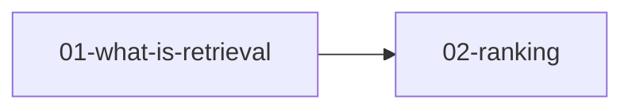

# Chapter 1. Intro

이 장은 기능 목록이 아니라 **왜 생성 전에 검색이 오는가**라는 하나의 흐름을
이해하는 장이다 — 문서를 찾아오는 단계([[01-what-is-retrieval]])와 그것을
추려서 줄 세우는 단계([[02-ranking]])가 어떻게 이어지는지를 본다.

## 읽는 순서

## 노트 → 원문 질문

| 노트 | 원문에서 답하는 질문 |
|---|---|
| [[01-what-is-retrieval]] | 검색이 왜 생성보다 먼저 오는가? |
| [[02-ranking]] | 찾아온 문서를 그대로 다 쓰면 안 되는 이유는? |

원문 커버리지 전체는 [[_coverage]] 에서 확인한다.

<!-- ==== 아래는 내 메모 · 스킬 수정 금지 ==== -->

## 내 메모
